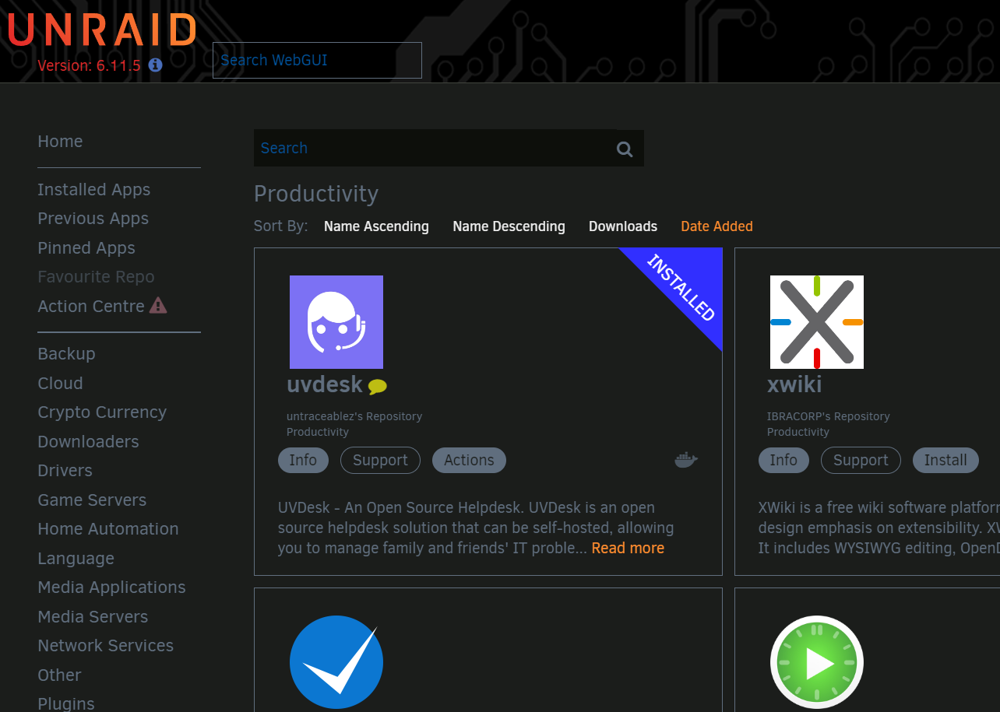

# stable-diffusion

## Table of Contents

 * [What is stable-diffusion?](#what-is-stable-diffusion)
 * [Self-Hosting](#self-hosting)
    * [Docker Run / Docker Compose](#docker-run--docker-compose)
    * [Non-Docker Setup](#non-docker-setup)
    * [unRAID](#unraid)
        * [Reverse Proxy](#reverse-proxy)
        * [unRAID Requirements](#unraid-requirements)
        * [Install stable-diffusion from Community Applications](#installing-stable-diffusion-from-community-applications)
    * [Accessing stable-diffusion &  First-Time Setup](#accessing-stable-diffusion--first-time-setup)
* [Acknowledgements](#acknowledgements)

## What is stable-diffusion?

[**stable-diffusion**](https://stability.ai/) is an AI image generator, powered by machine learning models.

## Self-Hosting

### Docker Run / Docker Compose

This is a container template for hosting stable-diffusion on [unRAID](https://unraid.net/). If you are not using unRAID, there are better `docker-compose` and `docker-run` templates out there, such as the base for this unRAID image, [kestr3l/stable-diffusion-webui](https://hub.docker.com/r/kestr3l/stable-diffusion-webui).

### unRAID

Alright, the main event and what this template is made for. If you're running unRAID you should be able to find this template underneath the **Other** or **Tools** sections in Community Applications, or by searching for `stable-diffusion`. 

#### unRAID Requirements

#### Reverse-Proxy

A reverse proxy is not required, but if you want to make it public (I highly suggest not, or making sure to use Page Rules to prevent bot scraping), here are some great guides below:

* IBRACORP NGINX Proxy Manager Guide: <https://youtu.be/h1a4u72o-64>
* IBRACORP NGINX Proxy Manager **with Cloudflare** Guide: <https://www.youtube.com/watch?v=c6Y6M8CdcQ0>
* Spaceinvaderone's Reverse Proxy Guide (SWAG): <https://youtu.be/I0lhZc25Sro>

There are other guides, but these are all unRAID specific and should get you what you need to setup a reverse proxy. Note, the reverse proxy **must be setup prior to installing stable-diffusion**.

#### Installing stable-diffusion from Community Applications

To install stable-diffusion from Community Applications, simply navigate to Community Apps and head to either **Other** or **Tools**, or just search `stable-diffusion`, you should see it in the results like this: 

#### Accessing stable-diffusion &  First-Time Setup

##### Configuring the Container
When you get to the container configuration page in unRAID, make sure to fill in your GPU ID, and select the WebUI port you'd like to use. 

##### Accessing the webUI
After that, just hit apply and when you navigate to your domain name or http://SERVERIP:7680 you'll be presented with the webUI. That's it, have fun with it! 

## Acknowledgements

Thanks just to the overall unRAID community, it's a blast to contribute something back!
